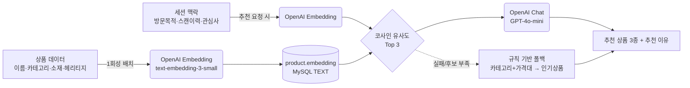

# TagOn AI · Backend

> 명품 매장에 부착된 NFC 태그를 스캔하면 시작되는, AI 기반 매장 컨시어지 서비스의 백엔드입니다.
> 고객은 직원 없이도 상품 정보를 탐색하며 AI에게 자유롭게 질문할 수 있고, 매장은 고객의 행동 패턴을 읽어 **적절한 순간에 직원과 대화할 수 있도록 합니다.**

[](#)
[](#)
[](#)
[](#)

---

## 1. 프로젝트 개요

명품 매장은 고객이 직원에게 말 걸기를 부담스러워하는 반면, 매장은 "지금 관심은 있지만 이탈 직전인 고객"을 놓치기 쉽습니다.

**TagOn AI**는 상품에 붙은 태그를 스캔하는 순간부터 세션을 시작해, 두 가지 축으로 이 문제를 풉니다.

- **셀프 탐색**: 소재·헤리티지·사이즈·컬러 같은 상품 정보를 AI QnA와 함께 스스로 확인
- **선제적 개입**: 스캔/체류 시간/가격 조회/시착 요청 등 행동 로그를 규칙 엔진이 실시간 채점해, 이탈 신호가 보이면 직원 호출 또는 콘텐츠 제안을 자동으로 팝업


---

## 2. 핵심 기능

| 기능 | 설명 |
| --- | --- |
| **태그 스캔 & 상품 허브** | 태그(SKU) 스캔 시 상품 요약 + 1차 허브(상품이해/핏선호/구매조건/기타) 4종 반환. 하위 옵션(소재/헤리티지/관리·안감/원산지/사이즈/컬러)은 **선택된 SKU 기준**으로 정확한 값만 노출, 없으면 추정하지 않고 null |
| **AI 자유질문 QnA** | 고객이 자유 텍스트로 질문하면 GPT-4o-mini가 해당 상품의 소재·헤리티지 컨텍스트 안에서만 답변. 가격/재고/할인처럼 민감한 질문은 환각 대신 직원 상담으로 자연스럽게 유도 |
| **AI 상품 추천** | 세션의 방문 목적·스캔 이력·관심사를 벡터화해 코사인 유사도로 유사 상품 3종을 추천하고, LLM이 추천 이유를 한 문장으로 생성. 실패 시 카테고리+가격대 규칙 → 인기상품 순으로 자동 폴백 |
| **여정 카드(패스포트)** | 세션이 스캔한 상품들의 관심도(문의/시착/연락처 제공/가격조회/재방문/허브 클릭 등 가중합산)를 계산해 상위 4개를 콜라주 이미지로 구성하고, 가장 많이 태그 스캔한 색상(`favoriteColor`)도 함께 제공 |
| **선제적 개입 엔진 (Blocker)** | 품절 조회, 직원 호출 미응답, 가격 확인 후 저가 상품으로 이탈, 시착 후 무응답, 재방문·비활성 등 상황별 트리거를 감지해 팝업(CTA)을 자동 생성 |
| **직원 호출 · 시착 요청 · 구매 문의 · 연락처 수집 · 방문 목적** | 매장 직원과의 연결이 필요한 순간들을 세션 단위로 기록 |

---

## 3. AI 사용처

### 3-1. 임베딩 기반 추천

별도 벡터DB 없이 **텍스트 컬럼 저장 + 애플리케이션 레벨 코사인 유사도**로 구현했습니다.



- 상품 벡터는 `--backfill-product-embeddings` 옵션으로 최초 1회만 생성(레이트리밋 대응 250ms 대기)
- LLM 응답은 JSON 강제 + 후보 목록에 없는 상품 ID는 필터링해 환각 방지

### 3-2. 그라운딩된 자유질문 QnA

- 시스템 프롬프트로 **"컨텍스트에 없는 내용은 지어내지 말 것", "민감 정보는 회피 대신 직원 상담 유도"**를 강제
- 응답을 `{"answer": string, "resolved": boolean}` 형태의 JSON으로 받아 상담 해결 여부를 함께 추적
- OpenAI 호출 실패/타임아웃 시에도 서비스가 죽지 않도록 고정 fallback 답변으로 자동 전환

### 3-3. 다단 Graceful Fallback 설계

AI 호출(임베딩/챗) 실패가 서비스 장애로 번지지 않도록, AI가 필요한 모든 경로에 규칙 기반 대체 로직을 두었습니다. (추천: 벡터 유사도 → 카테고리/가격대 규칙 → 인기상품 / QnA: LLM 답변 → 고정 fallback 문구)

---

## 4. 선제적 개입(Blocker) 엔진

행동 로그를 실시간으로 채점해 이탈 직전 고객에게 개입 시점을 자동으로 판단하는 규칙 엔진입니다.

| 트리거 | 조건 | 개입 |
| --- | --- | --- |
| **CB1** | 수령방법별 재고 확인 시 재고 없음 | 타매장 재고 확인 / 대체 제품 추천 팝업 |
| **CB3** | 직원 호출 후 5분 이상 미응답 | 재호출 유도 팝업 |
| **CB5** | 가격 확인 후 같은 카테고리의 더 낮은 가격대 상품으로 전환, 또는 가격 확인 후 10분간 무활동 | 가격 안내 / 콘텐츠 제안 |
| **CB6** | 시착 요청 후 15분 경과, 동일 상품 재방문(2회↑ & 체류 3분↑), 상담 종료 후 5분 무활동 | 콘텐츠 제안 |

각 트리거는 이미 처리된 세션/이벤트에 대해 중복 생성되지 않도록 방지 로직을 포함하고, 세션이 종료되면 더 이상 평가하지 않습니다.

---

## 5. 기술 스택

| 영역 | 사용 기술 |
| --- | --- |
| Language / Framework | Java 17, Spring Boot 4.1 (Web MVC, Validation, AOP, Actuator) |
| Database | MySQL 8, Flyway (스키마 버전 관리, 20개 마이그레이션) |
| AI | OpenAI API — Chat Completions(`gpt-4o-mini`), Embeddings(`text-embedding-3-small`) |
| API 문서 | springdoc-openapi (Swagger UI) |
| 테스트 | JUnit 5, MockMvc, Testcontainers(MySQL) 기반 도메인별 통합 테스트 |
| 인프라 | Docker / Docker Compose, GitHub 기반 배포 → EC2 |
| 연동 프론트엔드 | React (Vite), Vercel 배포 |

---

## 6. API 한눈에 보기

세션(`sessionId`) 하나가 매장 방문 한 번을 의미하며, 모든 도메인이 세션을 중심으로 엮입니다.

| 도메인 | 대표 엔드포인트 | 설명 |
| --- | --- | --- |
| Session | `POST /api/v1/sessions` | 세션 시작/닉네임 설정/종료 |
| Product | `GET /api/v1/products/tags/{tagId}` | 태그 스캔 → 상품 정보 + 1차 허브 |
| Product | `GET /api/v1/products/{productId}/hub/options/{optionId}` | 허브 하위 옵션 상세 (소재/헤리티지/사이즈 등, `skuId`로 색상별 정확한 값 조회) |
| Product | `POST /api/v1/products/{productId}/pickup-check` | 픽업 방식별 재고 확인 |
| Sku | `GET /api/v1/products/{productId}/skus`, `GET /api/v1/products/{productId}/skus/{skuId}` | 색상별 SKU 목록 / SKU 상세(사이즈·치수·이미지) 조회 |
| Recommendation | `GET /api/v1/session/recommendations` | AI 유사도 기반 추천 3종 |
| QnA | `POST /api/v1/products/{productId}/qna` | 상품 기반 AI 자유질문 |
| JourneyCard | `GET /api/v1/session/journey-card` | 관심도 기반 여정 카드(콜라주) |
| PendingAction | `GET /api/v1/session/pending-action`, `POST /api/v1/actions/{actionId}/respond` | 선제적 개입 팝업 조회/응답 |
| StaffCall / TryonRequest / PurchaseInquiry / Contact / VisitPurpose | `POST /api/v1/session/...` | 직원 호출, 시착 요청, 구매 문의, 연락처, 방문 목적 |

전체 스펙은 서버 기동 후 `/swagger-ui/index.html`에서 확인할 수 있습니다.

---

## 7. 프로젝트 구조

도메인 단위 패키지 구조로, 각 도메인은 `controller / service / repository / entity / dto` 로 구성됩니다.

```
domain/
├── product/          # 태그 스캔, 상품 허브, 픽업 재고 확인
├── sku/               # 색상·사이즈 단위 SKU
├── recommendation/    # 임베딩 기반 AI 추천
├── qna/                # AI 자유질문
├── journeycard/       # 관심도 기반 여정 카드
├── pendingaction/     # 선제적 개입(Blocker) 엔진
├── session/           # 세션 생명주기
├── tagscanlog/        # 태그 스캔 이력
├── interactionlog/    # 허브/서브허브 클릭 등 관심사 로그
├── staffcall/         # 직원 호출
├── tryonrequest/      # 시착 요청
├── purchaseinquiry/   # 구매 문의
├── contact/           # 연락처 수집
└── visitpurpose/      # 방문 목적

global/
├── ai/                # OpenAiClient, EmbeddingCodec, CosineSimilarity
├── aop/                # 세션 활성 여부 가드 (@RequiresActiveSession)
├── exception/          # 도메인 공통 예외/에러코드
└── entity/             # BaseEntity(생성/수정 시각)

internal/              # [시연/테스트 전용] app.internal-test-endpoints.enabled=true일 때만 등록
└── controller/         # 물리 NFC 태그 없이 랜덤 태그 스캔 등, 정식 기능이 아닌 데모용 엔드포인트
```

---

## 8. 실행 방법

```bash
# 프로젝트 루트에 .env 파일 생성 (DB_URL, DB_USERNAME, DB_PASSWORD, OPENAI_API_KEY)
docker compose up --build
```

- 앱: `http://localhost:8080`
- API 문서: `http://localhost:8080/swagger-ui/index.html`
- `OPENAI_API_KEY`가 없으면 AI 호출부는 자동으로 규칙 기반 폴백으로 동작합니다(서비스 다운 없음).
- `APP_INTERNAL_TEST_ENDPOINTS_ENABLED=true`로 설정하면 물리 NFC 태그 없이 시연할 수 있는 `internal/` 테스트 전용 엔드포인트가 등록됩니다(기본값 false).

### 로컬 테스트

```bash
./gradlew test
```

Testcontainers로 실제 MySQL 컨테이너를 띄워 도메인별 통합 테스트를 수행합니다.

---

## 9. 팀

**사춘기온사자**
PM 정민규
DE 박윤서 이수민
FE 신하빈 최정인
BE 이어진
